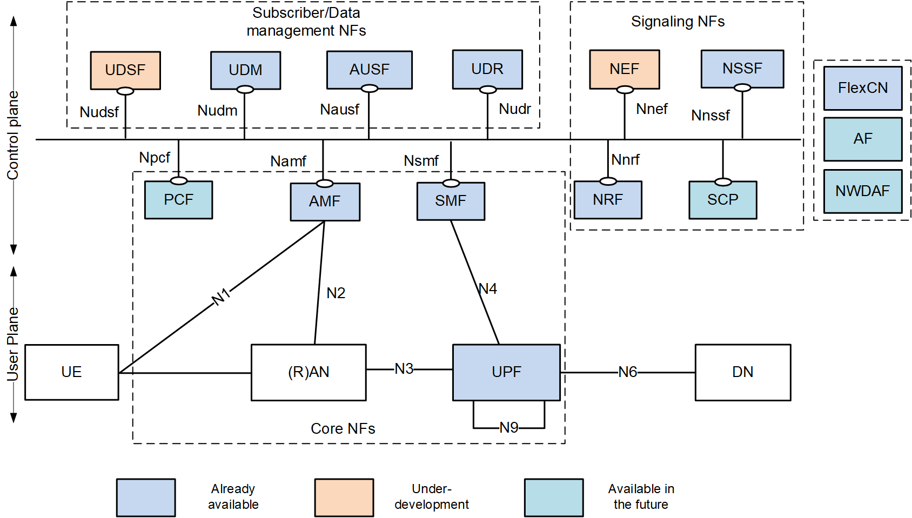

<table style="border-collapse: collapse; border: none;">
  <tr style="border-collapse: collapse; border: none;">
    <td style="border-collapse: collapse; border: none;">
      <a href="http://www.openairinterface.org/">
         
         </img>
      </a>
    </td>
    <td style="border-collapse: collapse; border: none; vertical-align: center;">
      <b>OpenAirInterface NEF Feature Set</b>
    </td>
  </tr>
</table>

**Table of Contents**

1. [5GC Service Based Architecture](#1-5gc-service-based-architecture)
2. [OAI NEF Available Interfaces](#2-oai-nef-available-interfaces)
3. [OAI NEF Feature List](#3-oai-nef-feature-list)

# 1. 5GC Service Based Architecture #

# 2. OAI NEF Available Interfaces #

| **ID** | **Interface** | **Status**         | **Comment**                                      |
| ------ | ------------- | ------------------ | -------------------------------------------------|
| 1      | SBI           | :heavy_check_mark: | between NEF and other NFs                        |

# 3. OAI NEF Feature List #

Based on document **3GPP TS 23.501 v16.0.0 (Section 6.2.5)**.

| **ID** | **Classification**                                                        | **Status**         | **Comments**                             |
| ------ | ------------------------------------------------------------------------- | ------------------ | ---------------------------------------- |
| 1      | Exposure of capabilities and events                                       | :heavy_check_mark: | Partially implemented for the AMF events |
| 2      | Secure provision of information from external application to 3GPP network | :x:                |                                          |
| 3      | Translation of internal-external information                              | :x:                |                                          |
| 4      | Exposure of analytics                                                     | :x:                |                                          |
| 5      | Retrieval of data from external party by NWDAF                            | :heavy_check_mark: | Partially implemented                    |
| 6      | Support of Non-IP Data Delivery                                           | :x:                |                                          |
| 7      | Support of UAS NF functionality                                           | :x:                |                                          |
| 8      | Support of EAS deployment functionality                                   | :x:                |                                          |
