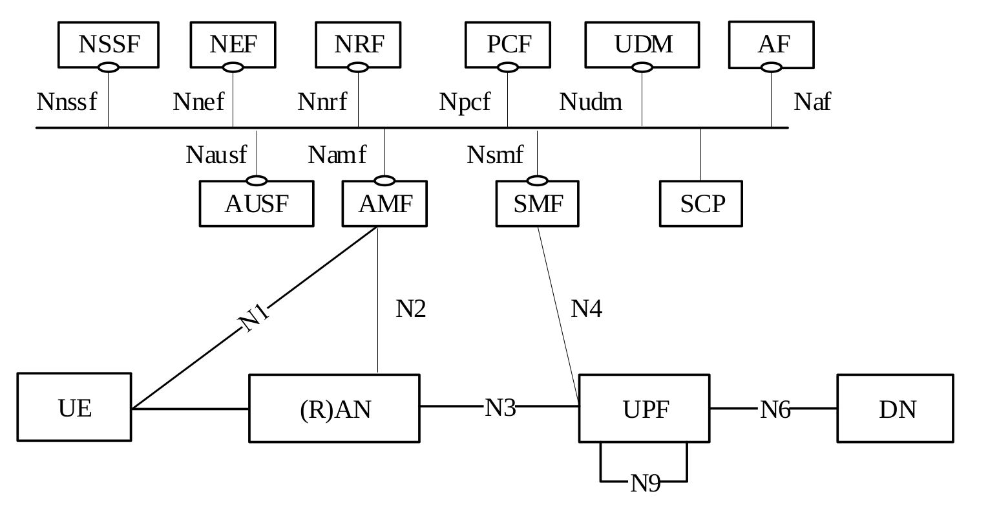
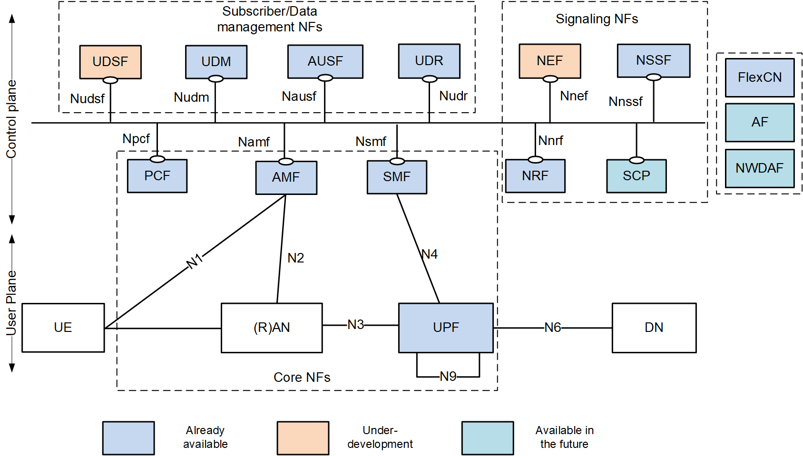

<table style="border-collapse: collapse; border: none;">
  <tr style="border-collapse: collapse; border: none;">
    <td style="border-collapse: collapse; border: none;">
      <a href="http://www.openairinterface.org/">
         
         </img>
      </a>
    </td>
    <td style="border-collapse: collapse; border: none; vertical-align: center;">
      <b>OpenAirInterface PCF Feature Set</b>
    </td>
  </tr>
</table>

**Table of Contents**

1. [5GC Service Based Architecture](#1-5gc-service-based-architecture)
2. [OAI PCF Available Interfaces](#2-oai-pcf-available-interfaces)
3. [OAI PCF Feature List](#3-oai-pcf-feature-list)

# 1. 5GC Service Based Architecture #

# 2. OAI PCF Available Interfaces #

| **ID** | **Interface** | **Status**         | **Comment**             |
|--------|---------------|--------------------|-------------------------|
| 1      | N7 (*) (**)   | :heavy_check_mark: | between PCF and SMF     |
| 2      | N5            | :x:                | between PCF and AF      |
| 3      | N15           | :x:                | between PCF and AMF     |
| 4      | N24           | :x:                | between V-PCF and H-PCF |
| 5      | N36           | :x:                | between PCF and UDR     |

(*): support both HTTP/1.1 and HTTP/2  
(**): UpdateNotify feature not supported

# 3. OAI PCF Feature List #

Based on documents **3GPP TS 23.501 v16.0.0 (Section 6.2.4)** and **3GPP TS 23.503 v16.0.0 (Section 6.2.1)**

| **ID** | **Classification**                                                   | **Status**         | **Comments**                |
|--------|----------------------------------------------------------------------|--------------------|-----------------------------|
| 1      | Policy and charging control for a service data flows                 | :x:                |                             |
| 2      | PDU Session related policy control                                   | :heavy_check_mark: | Except UpdateNotify feature |
| 3      | PDU Session event reporting to the AF                                | :x:                |                             | 
| 4      | Access and mobility related policy control                           | :x:                |                             |
| 5      | UE access selection and PDU Session selection related policy control | :x:                |                             |
| 6      | Negotiation for future background data transfer                      | :x:                |                             |
| 7      | Usage monitoring                                                     | :x:                |                             | 
| 8      | Sponsored data connectivity                                          | :x:                |                             |
| 9      | Input for PCC decisions                                              | :x:                | Currently only local rules  |
| 10     | Policy control subscription information management                   | :x:                |                             |
| 11     | V-PCF                                                                | :x:                |                             |
| 12     | H-PCF                                                                | :x:                |                             |
| 13     | Application specific policy information management                   | :x:                |                             |
| 14     | NRF NF Registration                                                  | :heavy_check_mark: |                             |
