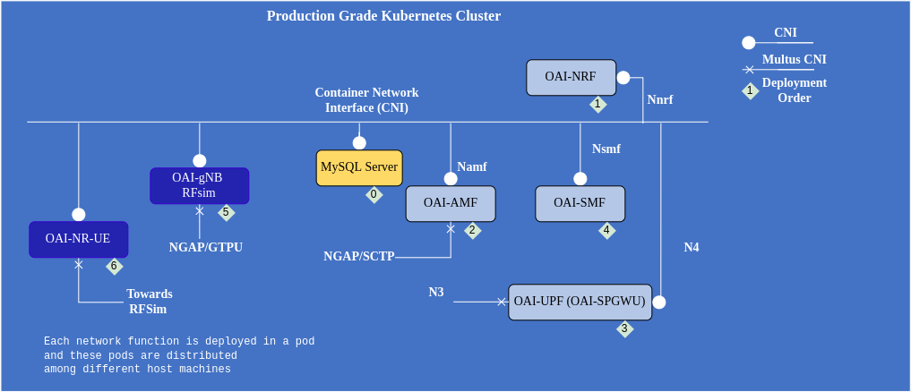

<table style="border-collapse: collapse; border: none;">
  <tr style="border-collapse: collapse; border: none;">
    <td style="border-collapse: collapse; border: none;">
      <a href="http://www.openairinterface.org/">
         
         </img>
      </a>
    </td>
    <td style="border-collapse: collapse; border: none; vertical-align: center;">
      <b><font size = "5">OpenAirInterface 5G Core Network Deployment using Helm Charts</font></b>
    </td>
  </tr>
</table>


OAI 5G core network have different network functions which can be used invidiually or deployed all together in different combination on a production grade Kubernetes cluster like Openshift or a vanilla kubernetes cluster. 




**Reading time**: ~30

**Tutorial replication time**: ~40 mins


**TABLE OF CONTENTS**

1.  [Description](#1-description)
2.  [Fetching Network Function Images](#2-fetching-network-function-images)
3.  [Configuring Helm Charts](#3-configuring-helm-charts)
4.  [Deploying 5g Core Helm Charts](#4-deploying-helm-charts)
5.  [Optional: Testing with OAI gNB RFsimulator and NR-UE](#5-testing-with-oai-gnb-rfsimulator-and-nr-ue)
6.  [Extra](#6-extra)

### Pre-requisite

The cluster on which these helm charts will be deployed should have RBAC and [Multus CNI](https://github.com/k8snetworkplumbingwg/multus-cni). Multus is necessary to provide multiple interfaces to AMF and UPF/SPGWU. In case you don't have multus CNI for seconary network interface inside the pod you can still use the ethernet interface provided by the primary CNI. This type of setting is only recommended for playing with rfsimulator. In case you are using minikube or any other Kubernetes deployer make sure you have minimum 4 CPU and 16 GBi of ram. 

Clone the git repository 

```console 
$: git clone -b <Branch> https://gitlab.eurecom.fr/oai/cn5g/oai-cn5g-fed
```

## 1. Description

The helm charts can be used on any production grade kubernetes cluster or even vanilla kubernetes. We have also tested on a single node 4 CPU and 16GB ram minikube cluster with docker virtualization environment. In our testing environment we deploy these charts on our inhouse Openshift clusters the cluster information can be found below.

| Software                        | Version                                |
|:--------------------------------|:---------------------------------------|
| Openshift Client Version        | 4.9.X                                  |
| Kubernetes Version              | Kubernetes Version: v1.22.5+5c84e52    |
| helm                            | v3.6.2+5.el8                           |
| helm-spray (plugin)             | v4.0.10                                |
| Base images of Network functions| Ubuntu 18.04/20.04/22.04/UBI 8.X(RHEL8)|

**NOTE**: For gNB the host machines should have `avx2` to find out you can use `lscpu | grep avx2`

We are deploying the helm charts using `helm spray` plugin of `helm` as the network functions have dependency and they are required to be deployed in a certain order. To get more information on helm spray you can follow this [link](https://github.com/ThalesGroup/helm-spray).

For the moment we provide helm charts of inidividual network functions, udr, udm, ausf, amf, nrf, smf, upf and nssf. To make the deployment of the network function easier we provide three different settings in which they can be deployed

1. Minimalist deployment: Mysql (Subscriber Database), AMF, SMF, UPF, NRF
2. Basic deployment: Mysql (Subscriber Database), UDR, UDM, AUSF, AMF, SMF, UPF, NRF
3. Slicing support: Mysql (Subscriber Database), NSSF, UDR, UDM, AUSF, AMF, SMF, UPF, NRF

In this tutorial we will deploy a minimalist setting of OAI 5g core network and will deploy oai-gNB and oai-nr-ue in rf-simulator mode to perform some traffic testing. You can also deploy the core network in other two settings. It all depends on your use case and testbed. The configuration parameters of helm charts are the same as `docker-compose` so if you know how to configure `docker-compose` yaml file you can configure the helm charts `value.yaml`.


## 2. Fetching Network Function Images

Ubuntu base images can be pulled from [docker-hub](https://hub.docker.com/u/oaisoftwarealliance) but if you want to make some changes in the code then you should build your own images. If you will use Ubuntu images then skip this part and in section `3.1` there is a detailed procedure. In case of RHEL based worker node you have to build your own images, to download packages from RHEL repository you need a developer or enterprise account. To learn how to build UBI 8.6 images follow this [tutorial](./openshift/README.md)

OAI network functions can be build on ubuntu 18.04/20.04/22.04 or UBI 8.6 base images. Follow the tutorial on [how to build images](./BUILD_IMAGES.md) depending on the cluster/worker-node operating system.

## 3. Configuring Helm Charts

```console
$: cd oai-cn5g-fed
$: ls charts/
oai-5g-core  oai-5g-ran  simulators  testing
$: ls charts/oai-5g-core/
mysql  oai-5g-basic  oai-5g-mini  oai-5g-slicing  oai-amf  oai-ausf  oai-nrf  oai-nssf  oai-smf  oai-spgwu-tiny  oai-udm  oai-udr
$: ls charts/oai-5g-ran/
oai-gnb  oai-gnb-cu  oai-gnb-du  oai-nr-ue
$: ls charts/simulators/
gnbsim
$: ls charts/testing/
testing-pod.yaml
```

All the OAI core network charts are present in `oai-5g-core` folder. There you can find charts of individual network functions and for the above described three different deployment settings. 

1. Folder `oai-5g-mini` is for [minimilist deployment](../charts/oai-5g-core/oai-5g-mini)
2. Folder `oai-5g-basic` is for [basic deployment](../charts/oai-5g-core/oai-5g-basic)
3. Folder `oai-5g-slicing` is for [slicing deployment](../charts/oai-5g-core/oai-5g-slicing)

These charts are configured keeping in mind 5G service based architecture. If you want to deploy using reference based architecture then you need to make sure each network functions can connect to each other using IP-Address or service name. 

The structure of all these folders is similar, 

```
oai-5g-mini/
├── Chart.yaml
└── values.yaml

0 directories, 2 files
```

In the `values.yaml` file we have put only those configuration parameters which we think are really necessary and they should be changed based on PLMN, DNN and sim card information. In case you want to change some other parameters we suggest you go in the helm charts of the respective network function and do the changes there. 

Helm chart of every network function looks similar and has the below structure. Only the chart of mysql database and NRF is different.

```
Network_function/
├── Chart.yaml
├── templates
│             ├── configmap.yaml
│             ├── deployment.yaml
│             ├── _helpers.tpl
│             ├── multus.yaml
│             ├── NOTES.txt
│             ├── rbac.yaml
│             ├── serviceaccount.yaml
|             └── service.yaml
└── values.yaml 

1 directory, 10 files
```

All the configurable parameters for a particular commit/release are mentioned in the `values.yaml` file. These parameters will keep on changing in the future depending on the nature of development and features. 

All the network function related configurable parameters are in the sections `config` of the `values.yaml`. 

Create a namespace where the helm-charts will be deployed, in our environment we deploy them in `oai-tutorial` namespace. To create a namespace use the below command on your cluster, 

```console
# needs a user which has the right to create namespaces
$: kubectl create ns oai-tutorial
or 
$: oc new-project oai-tutorial
```

**NOTE**: Any changes done in the parent chart (Mini, basic, slicing scenario helm charts) will overwrite the sub charts.  

### 3.1 Pulling Images

To pull images from docker-hub, it will be good to configure an image pull secrete because of the recent limit of 100 pulls in docker-hub from an anonymous account. If you provide a personal/company account the limit is different. 

```bash
#kubernetes
$: kubectl create secret docker-registry regcred --docker-server=https://index.docker.io/v1/ --docker-username=<your-name> --docker-password=<your-pword> --docker-email=<your-email>
#openshift 
$: oc create secret docker-registry regcred --docker-server=https://index.docker.io/v1/ --docker-username=<your-name> --docker-password=<your-pword> --docker-email=<your-email>

```
There are more ways to make docker secrete you can follow this [link](https://kubernetes.io/docs/tasks/configure-pod-container/pull-image-private-registry/). After this mention this in the `values.yaml` of each network function

```
## good to use when pulling images from docker-hub
imagePullSecrets:
  - name: regcred
```

When pulling images from docker hub you have several choices either to use images with develop tag (based on latest develop branch somtimes might not be stable), latest (built from current master branch) and release tags. 

### 3.2 Networking Related Information

Network functions communicate based on **kubernetes service concept**, the network functions are using service name/FQDN of other network functions to use their service. 

*For example: AMF registers with NRF using NRF FQDN (`oai-nrf-svc.oai.svc.cluster.local`). This way we can get rid of any static ip-address configuration. Though we are still keeping the fields where we are mentioning ip-addresses for example `nrfIpv4Addr` in amf values.yaml but that is not being used if `USE_FQDN_DNS` is set to `true`*

#### 3.2.1 Configure Multiple Interfaces

- Here the network functions will use different virtual ethernet interfaces to bind their different logical interface. Example AMF communicates with gNB using N2 and with SMF and NRF using Namf, the Service Base Interface (SBI).
- This type of configuration is also used when gNB is outside of the cluster or UPF is outside of the cluster. 
- To make the above seperation we are using multus to provide multiple ethernet interfaces to network functions which have multiple communication interfaces.
- Only AMF, SMF and UPF have the possiblity to use multus. Other network functions can also use multus but then it needs to be configured. 
- To configure multus for AMF, SMF or UPF, in `values.yaml` of each network function edit the multus section.

```
## Example from oai-amf/values.yaml
multus:
  create: true
  n2IPadd: "<provide-an-ip-address>"
  n2Netmask: "<provide-a-netmask>"
  n2Gateway: "<Gateway>"
```

#### 3.2.2 Use Single Interface

- No need to configure multus for any network function. For different communication interfaces network functions will use same ethernet interface. Example AMF will use `eth0` interface to communicate with gNB, SMF and NRF.
- In `values.yaml` of AMF, SMF and UPF in multus section do multus.create `false` like below, 

```
## Example from oai-amf/values.yaml
multus:
  create: false (change only this)
```

#### 3.2.3 Capturing Packets (Optional)

Every network function has an extra TCP dump container to take the TCP dump. But by default this container start in sleep mode and does not capture the dumps on any interface. If enabled it will capture dumps on `all interfaces` and will store inside the container locally or in a persistant volume if enabled. 

To enable the persistant volume in the `values.yaml` of every network function make the below change, 

```
## in case of nrf but it same for every network function
start:
  nrf: start
  tcpdump: start #start tcpdump collection to analyse but beware it will take a lot of space in the container/persistent volume

persistence:
  sharedvolume: true
  volumneName: <configure-your-storage-name>
  size: <configure-the-size> #example 1Gi

```

## 3.3 Configuring Helm Chart Parameters

In the [values.yaml](../charts/oai-5g-core/oai-5g-mini) of oai-5g-mini helm charts you will see the configurable parameters for all the network functions check, the PLMN, DNN and subscriber information in mysql database

For minimalist deployment check the database [oai_db-mini.sql](../charts/oai-5g-core/mysql/initialization/oai_db-mini.sql)

A new subscriber entry can be added directly in the sql file or it can be added once the core network is already deployed. 

```sql
$: vim/vi/nano charts/oai-5g-core/mysql/initialization/oai_db-mini.sql
# Add a new or edit existing entries after users table
INSERT INTO `users` VALUES ('IMSI','41','55000000000012',NULL,'PURGED',50,40000000,100000000,47,0000000000,1,0x'key',0,0,0x40,'ebd07771ace8677a',0x'opc');
```

In case you are looking for some other paramter which are not available in the `values.yaml` file of the oai-5g-mini chart then check in the invidual chart of the network function. 

Once the charts are configured perform helm dependency update inside the chart repository

``` shell
$: cd charts/oai-5g-core/oai-5g-mini
$: helm dependency update
```

**NOTE**: Whenever you will make any change in the network function helm-chart or mysql helm chart you need to perform a dependency update to inform parent chart about the sub-charts update. 

## 4. Deploying Helm Charts

The network functions need to be deployed in an order, we are working towards removing this order from network function. 

`mysql --> nrf --> amf --> upf(spgwu) --> smf`

Once the configuration is finished the charts can be deployed with a user who has the rights to

1. Create RBAC (Only needed in Openshift)
2. Run pod with privileged and anyuid scc (optional only required if you have scc configure in your cluster)
3. Create multus binds (optional only if you use multus)


``` shell
# Expecting current directory to be oai-5g-mini
$: helm spray --namespace oai-tutorial .
[spray] processing chart from local file or directory "."...
[spray] deploying solution chart "." in namespace "default"
[spray] processing sub-charts of weight 0
[spray]   > upgrading release "mysql": deploying first revision (appVersion 8.0.31)...
[spray]     o release: "mysql" upgraded
[spray]   > upgrading release "oai-nrf": deploying first revision (appVersion master-v1.5.0)...
[spray]     o release: "oai-nrf" upgraded
[spray]   > waiting for liveness and readiness...
[spray] processing sub-charts of weight 2
[spray]   > upgrading release "oai-amf": deploying first revision (appVersion master-v1.5.0)...
[spray]     o release: "oai-amf" upgraded
[spray]   > waiting for liveness and readiness...
[spray] processing sub-charts of weight 3
[spray]   > upgrading release "oai-spgwu-tiny": deploying first revision (appVersion v1.5.0)...
[spray]     o release: "oai-spgwu-tiny" upgraded
[spray]   > waiting for liveness and readiness...
[spray] processing sub-charts of weight 4
[spray]   > upgrading release "oai-smf": deploying first revision (appVersion master-v1.5.0)...
[spray]     o release: "oai-smf" upgraded
[spray]   > waiting for liveness and readiness...
[spray] upgrade of solution chart "." completed in 47s
$: export AMF_POD_NAME=$(kubectl get pods --namespace oai-tutorial -l "app.kubernetes.io/name=oai-amf" -o jsonpath="{.items[0].metadata.name}")
$: export SMF_POD_NAME=$(kubectl get pods --namespace oai-tutorial -l "app.kubernetes.io/name=oai-smf" -o jsonpath="{.items[0].metadata.name}")
$: export SPGWU_TINY_POD_NAME=$(kubectl get pods --namespace oai-tutorial -l "app.kubernetes.io/name=oai-spgwu-tiny" -o jsonpath="{.items[0].metadata.name}")
$: export AMF_eth0_POD_IP=$(kubectl get pods --namespace oai-tutorial -l "app.kubernetes.io/name=oai-amf" -o jsonpath="{.items[0].status.podIP}")
```

```console
$: kubectl get pods --namespace oai-tutorial
NAME                              READY   STATUS    RESTARTS   AGE
mysql-6d95f95fb5-stl4j            1/1     Running   0          11m
oai-amf-597cdbd99f-6kmrr          2/2     Running   0          10m
oai-nrf-59f5c8cff5-w7596          2/2     Running   0          11m
oai-smf-5597cf5887-h5tpq          2/2     Running   0          10m
oai-spgwu-tiny-58587dfc58-mw8m9   2/2     Running   0          10m
```

## 4.1 How to check if the Core network is properly configured?

Check the logs `smf` and `upf` to see that the PFCP session is properly configured, 

```console
$: kubectl logs -c spgwu $SPGWU_TINY_POD_NAME -n oai-tutorial | grep 'Received SX HEARTBEAT REQUEST' | wc -l
$: kubectl logs -c smf $SMF_POD_NAME -n oai-tutorial | grep 'handle_receive(16 bytes)' | wc -l
```

If the value is more than 1 for both then it will verify that `smf` and `upf` have successfully registered to `nrf` and there is a PFCP session. 

Now go ahead and use OAI-gNB/gNBSIM or any other gNB or emulator to test the deployed core network.

## 5 Testing with OAI gNB RFsimulator and NR-UE

The images which are used in the tutorial are already present in docker-hub like the other images of OAI 5g core network functions. The charts of all the network functions are preconfigured to work with OAI-gnB and OAI-NR-UE end to end installation. 

### 5.1 Images OAI-gNB RFSimulator and OAI-NR-UE

For ubuntu based worker nodes the images can be pulled directly from docker-hub. To build images manually follow this [link](https://gitlab.eurecom.fr/oai/openairinterface5g/-/tree/develop/docker). In case you have an Openshift cluster then follow this [link](../openshift/README.)

### 5.2 Configuring OAI-gNB RFSimulator and OAI-NR-UE

**Very Important** To access internet in NR-UE the N6/SGI interface of UPF/SPGWU should be able access the internet. 

GNB requires the ip-address or service name of AMF. In case in AMF multus is used and N1/N2 interface is bind to multus interface, then please provide AMF ip-address. 

For this tutorial we are not using multus here for similicity, generally there should be two interfaces of gNB(for N2 and N3).

```
## oai-gNB configuration from values.yaml

config:
  mountConfig: false          #If config file is mounted then please edit mount.conf in configmap.yaml properly 
  useSATddMono: true
  timeZone: "Europe/Paris"
  rfSimulator: "server"
  useSATddMono: "yes"
  gnbName: "gnb-rfsim"
  mcc: "001"   # check the information with AMF, SMF, UPF/SPGWU
  mnc: "01"    # check the information with AMF, SMF, UPF/SPGWU
  mncLength: "2" # check the information with AMF, SMF, UPF/SPGWU
  tac: "1"     # check the information with AMF
  nssaiSst: "1"  #currently only 4 standard values are allowed 1,2,3,4 
  nssaiSd0: "ffffff"    #This value means noSD as defined by 3GPP
  amfIpAddress: "oai-amf-svc"  # amf ip-address or service-name oai-amf-svc
  gnbNgaIfName: "eth0"            # net1 in case multus create is true that means another interface is created for ngap interface, n2 to communicate with amf
  gnbNgaIpAddress: "status.podIP" # n2n3IPadd in case multus create is true
  gnbNguIfName: "eth0"   #net1 in case multus create is true gtu interface for upf/spgwu
  gnbNguIpAddress: "status.podIP" # n2n3IPadd in case multus create is true
  useAdditionalOptions: "--sa -E --rfsim --log_config.global_log_options level,nocolor,time"
  threadParallelConfig: "PARALLEL_SINGLE_THREAD"
  sdrAddrs: "serial=XXXXXXX"
``` 

### 5.3 Deploy OAI-gNB RFSimulator

To deploy the oai-gnb in rf simulator mode follow the below steps

``` shell
$: cd ../../oai-5g-ran/
$: helm install gnb oai-gnb --namespace oai-tutorial
helm install gnb oai-gnb
NAME: gnb
LAST DEPLOYED: Sun Jan 15 22:36:37 2023
NAMESPACE: default
STATUS: deployed
REVISION: 1
TEST SUITE: None
NOTES:
1. Get the application name by running these commands:
$: export GNB_POD_NAME=$(kubectl get pods --namespace oai-tutorial -l "app.kubernetes.io/name=oai-gnb,app.kubernetes.io/instance=gnb" -o jsonpath="{.items[0].metadata.name}")
$: export GNB_eth0_IP=$(kubectl get pods --namespace oai-tutorial -l "app.kubernetes.io/name=oai-gnb,app.kubernetes.io/instance=gnb" -o jsonpath="{.items[*].status.podIP}")
2. Note: This helm chart of OAI-gNB is only tested in RF-simulator mode not tested with hardware on Openshift/Kubernetes Cluster
```

To check if gnB is connected, read the logs of amf and check N2 setup procedure was correct or not, 

```console
$: kubectl logs -c amf $AMF_POD_NAME | grep 'Sending NG_SETUP_RESPONSE Ok' 
[2022-04-22T15:42:45.370382] [AMF] [amf_n2 ] [debug] Sending NG_SETUP_RESPONSE Ok
```

**NOTE** In case you get an error like below then please check `echo $AMF_POD_NAME` gives the name of the AMF pod. In case not then export AMF name to `AMF_POD_NAME` variable.

``` console
$: kubectl logs -c amf $AMF_POD_NAME | grep 'Sending NG_SETUP_RESPONSE Ok' 
error: expected 'logs [-f] [-p] (POD | TYPE/NAME) [-c CONTAINER]'.
POD or TYPE/NAME is a required argument for the logs command
See 'kubectl logs -h' for help and examples
```

### 5.4 Configure OAI-NR-UE RFSimulator

NR-UE requires the ip-address or service name of the gNB. Configure the service name or ip-address in `config.rfSimulator`. The charts are already configured. 

We are not using multus here just for similicity, generally there should be two interfaces.

```
config:
  timeZone: "Europe/Paris"
  rfSimulator: "oai-gnb"    # ip-address of gnb rf-sim or service name oai-gnb
  fullImsi: "001010000000100"       # make sure all the below entries are present in the subscriber database
  fullKey: "fec86ba6eb707ed08905757b1bb44b8f" 
  opc: "C42449363BBAD02B66D16BC975D77CC1"
  dnn: "oai" 
  nssaiSst: "1"                     # configure according to gnb and amf, smf and upf 
  nssaiSd: "16777215"               # This value means noSD as defined by 3GPP
  useAdditionalOptions: "-E --sa --rfsim -r 106 --numerology 1 -C 3619200000 --nokrnmod" 
```

### 5.5 Deploy OAI-NR-UE RFSimulator

To deploy the oai-nr-ue in rf simulator mode follow the below steps

``` shell
$: helm install nrue oai-nr-ue/ --namespace oai-tutorial
helm install nrue oai-nr-ue/
NAME: nrue
LAST DEPLOYED: Sun Jan 15 22:40:10 2023
NAMESPACE: default
STATUS: deployed
REVISION: 1
TEST SUITE: None
NOTES:
1. Get the application name by running these commands:
$: export NR_UE_POD_NAME=$(kubectl get pods --namespace oai-tutorial -l "app.kubernetes.io/name=oai-nr-ue,app.kubernetes.io/instance=nrue" -o jsonpath="{.items[0].metadata.name}")
2. Note: This helm chart of OAI-NR-UE is only tested in RF-simulator mode not tested with hardware on Openshift/Kubernetes Cluster
```

Now you are start reading the logs of amf, smf and other network function to understand the message flow. Once the pdu session establishment procedure is finished you will receive an ip-address. You can start performing some testing. 

check if the UE received an ip-address

```console
$: kubectl exec -it -n oai-tutorial -c nr-ue $NR_UE_POD_NAME -- ifconfig oaitun_ue1 |grep -E '(^|\s)inet($|\s)' | awk {'print $2'}
```


### 5.6 Performing some traffic testing

Inside the nr-ue pod there is an extra tcdump container which can be use to perform traffic testing via iperf3 or 

``` shell
$: kubectl exec -it -n oai-tutorial -c nr-ue $NR_UE_POD_NAME -- ping -I oaitun_ue1 -c4 google.fr
PING google.fr (142.250.178.131) from 12.1.1.2 oaitun_ue1: 56(84) bytes of data.
64 bytes from par21s22-in-f3.1e100.net (142.250.178.131): icmp_seq=1 ttl=117 time=25.0 ms
64 bytes from par21s22-in-f3.1e100.net (142.250.178.131): icmp_seq=2 ttl=117 time=28.0 ms
64 bytes from par21s22-in-f3.1e100.net (142.250.178.131): icmp_seq=3 ttl=117 time=27.0 ms
64 bytes from par21s22-in-f3.1e100.net (142.250.178.131): icmp_seq=4 ttl=117 time=24.7 ms

--- google.fr ping statistics ---
4 packets transmitted, 4 received, 0% packet loss, time 3002ms
rtt min/avg/max/mdev = 24.780/26.253/28.067/1.378 ms

## incase above doesn't work try with 8.8.8.8 instead of dns. If that works then probably you have't configure dns properly in SMF. 

```

If you ping via `eth0`, default CNI interface you will see different ping results than `oaitun_ue1` interface. Observe the difference in two pings one goes directly towards internet via host networking and second travels through OAI stack. 

### 5.7 Uninstall the helm charts

You can remove them one by one or you can use this command

``` shell
$: helm uninstall -n oai-tutorial $(helm list -aq -n oai-tutorial)

```

## 6. Extra

### 6.1 How to install helm spray plugin?

``` console
$: helm plugin install https://github.com/ThalesGroup/helm-spray
Downloading and installing spray v4.0.0...
Installed plugin: spray
-bash-4.2$ helm plugin list
NAME    VERSION DESCRIPTION
spray   4.0.0   Helm plugin for upgrading sub-charts from umbrella chart with dependency orders
```

### 6.2 How to capture pcaps inside a network function?

We have specially provided a sperate container to capture pcap for each network function you can get inside this container and use tcpdump command 

```console
$: kubectl exec -it -c tcpdump $AMF_POD_NAME -- /bin/sh
$: tcpdump -i any -n 
```

## 6.3 Resource Consumption of Network Functions

Below resource consumption is observered using Kubernetes metrics server while NR-UE was pinging to `google.fr`.

```console
$: kubectl top pods -n oai-tutorial
NAME                              CPU(cores)   MEMORY(bytes)   
mysql-6d95f95fb5-pml82            6m           466Mi           
oai-amf-597cdbd99f-nnr7m          7m           4Mi             
oai-gnb-7bf557fb94-ljk5p          1129m        1030Mi          
oai-nr-ue-7b45d698bb-8vqh7        1048m        536Mi           
oai-nrf-59f5c8cff5-jkmp8          16m          3Mi             
oai-smf-5597cf5887-l99sr          5m           4Mi             
oai-spgwu-tiny-58587dfc58-n28r7   10m          3Mi      
```